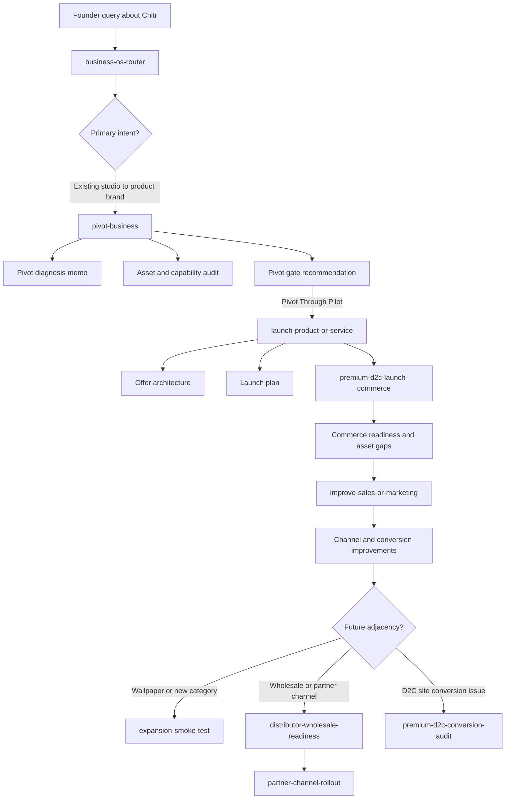

# Chitr Codex Skill Flow

Status: Working reference
Purpose: Show how Chitr would move through the current Business OS as a Codex-driven workflow, including which skills are called, in what order, and why.

Related:

- [chitr-business-os-end-to-end-run.md](/home/darko/Code/chitr/docs/chitr-business-os-end-to-end-run.md)
- [business-os-router skill](/home/darko/Code/chitr/.agents/skills/business-os-router/SKILL.md)
- [pivot-business skill](/home/darko/Code/chitr/.agents/skills/pivot-business/SKILL.md)
- [launch-product-or-service skill](/home/darko/Code/chitr/.agents/skills/launch-product-or-service/SKILL.md)
- [expansion-smoke-test skill](/home/darko/Code/chitr/.agents/skills/expansion-smoke-test/SKILL.md)

---

## 1. Why This Flow Exists

The Chitr example is useful because it is not a simple startup.

It has:

- an existing studio business
- real material capability
- a desire to create a product brand
- launch questions
- later expansion questions

That means the right Codex flow is not:

- just `$start-business`

It is a staged flow with routing and branching.

---

## 2. Flow Summary

Best top-level Codex path for Chitr:

1. `$business-os-router`
2. `$pivot-business`
3. `$launch-product-or-service`
4. `$premium-d2c-launch-commerce`
5. `$improve-sales-or-marketing`
6. later, when needed: `$expansion-smoke-test`

Possible specialist branches later:

- `$premium-d2c-conversion-audit`
- `$distributor-wholesale-readiness`
- `$partner-channel-rollout`

---

## 3. Flowchart

---

## 4. Skill-By-Skill Walkthrough

### Step 1: `$business-os-router`

When it should be called:

- when the founder starts with a broad Chitr query
- when multiple possible workflows are mixed together
- when it is not yet clear whether the need is startup, pivot, launch, or expansion

Example founder query:

- `We already have Studio Aalekh and want to build Chitr as a stronger product business. Where do we start?`

What router should conclude:

- primary intent: `Pivot Existing Business`
- secondary intents: `Launch`, `Improve Sales Or Marketing`, `Expansion`
- business context: `studio + physical product + hybrid`

Output:

- route to `$pivot-business`

### Step 2: `$pivot-business`

Why this is the core first skill:

- Chitr is fundamentally a service-to-product transition
- the business already has assets that should not be ignored
- this step diagnoses what should be preserved, stopped, and changed

What this skill should produce for Chitr:

- Current State / Pivot Diagnosis Memo
- Asset And Capability Audit
- future-state direction
- initial pivot gate

Key Chitr outcomes from this step:

- Chitr is a valid pivot direction
- Studio Aalekh capability is an advantage
- not all material families should be treated equally
- recommended gate: `Pivot Through Pilot`

### Step 3: `$launch-product-or-service`

When this should start:

- after the pivot direction is accepted
- once the question becomes `how should Chitr launch?`

What this skill should do:

- convert the pivot into a concrete launch structure
- define offer architecture
- define collection logic
- define what is in launch vs later

For Chitr, this is where decisions like these belong:

- which families are core
- which works are experimental
- how broad the first collection should feel
- what type of launch system the business is actually ready for

### Step 4: `$premium-d2c-launch-commerce`

Why this comes next:

- Chitr is a premium visual product business
- launch quality depends heavily on photography, PDP structure, storytelling, and trust signals

What this skill checks:

- product presentation readiness
- product page requirements
- room scenes and detail shots
- clarity around craftsmanship and material value
- conversion-readiness of the launch experience

For Chitr, this is one of the highest-value specialist skills.

### Step 5: `$improve-sales-or-marketing`

When this gets called:

- once Chitr is preparing to sell or starts seeing weak traction

What it should focus on:

- which channels to prioritize first
- how D2C and assisted selling should work together
- whether designers or direct buyers are converting better
- what messaging is weak
- where the funnel is breaking

This skill becomes more useful after at least some launch activity exists.

### Step 6: Later `$expansion-smoke-test`

When this should be called:

- not during the initial pivot diagnosis
- not during the first launch planning pass
- only when a real adjacency question appears

For Chitr, example:

- `Should we add wallpaper next year?`
- `Should we introduce printed wallpaper with embroidery?`
- `Should we import raw wallpaper from China or do local job work?`

This keeps future-category questions from polluting the first launch logic.

---

## 5. Ideal Chitr Query Progression In Codex

Here is the practical sequence in natural language.

### Query 1

Founder says:

- `We already run Studio Aalekh and want to build Chitr into a stronger business.`

Codex should use:

- `$business-os-router`

Then route to:

- `$pivot-business`

### Query 2

Founder says:

- `Help me define the Chitr direction and what should actually change.`

Codex should use:

- `$pivot-business`

### Query 3

Founder says:

- `Now help me structure the first Chitr collection and launch logic.`

Codex should use:

- `$launch-product-or-service`

### Query 4

Founder says:

- `Check whether the premium D2C presentation is strong enough.`

Codex should use:

- `$premium-d2c-launch-commerce`

### Query 5

Founder says:

- `We launched but sales are weak.`

Codex should use:

- `$improve-sales-or-marketing`

### Query 6

Founder says:

- `Should we add wallpaper now?`

Codex should use:

- `$expansion-smoke-test`

---

## 6. What This Shows About The System

The Chitr example proves an important point:

- the Business OS is not one skill
- it is a routed system of skills

And Chitr is a good example because the sequence is realistic:

- route
- pivot
- launch
- commerce readiness
- growth improvement
- later expansion

That is exactly the kind of modular operating-system behavior the framework was supposed to create.

---

## 7. Recommended Default Chitr Skill Stack

If someone asked for the minimum Codex stack to handle Chitr well, it would be:

1. `$business-os-router`
2. `$pivot-business`
3. `$launch-product-or-service`
4. `$premium-d2c-launch-commerce`
5. `$improve-sales-or-marketing`
6. `$expansion-smoke-test`

That is the clearest Chitr example of how Business OS should work in practice.
